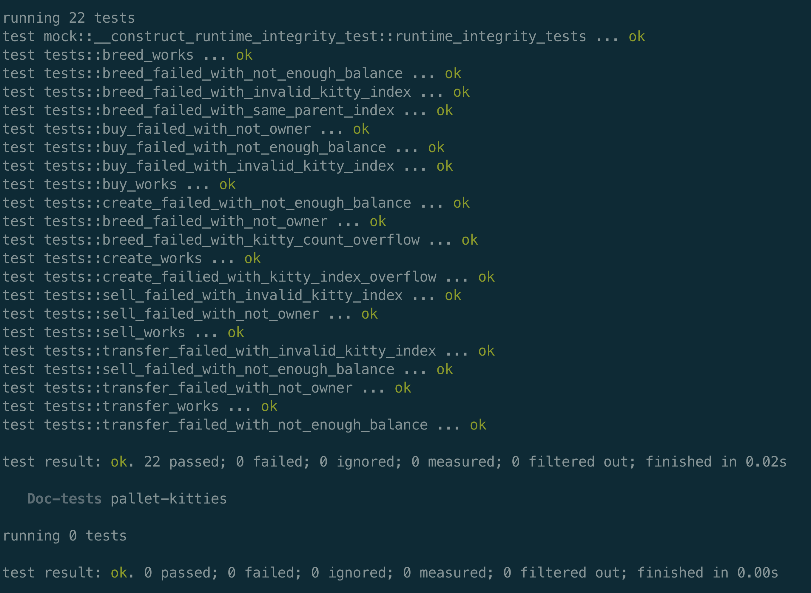

# Substrate进阶课程第二课作业

1. 增加买和卖的extrinsic，对视频中kitties的实现进行重构，提取出公共代码；
2. KittyIndex不在pallet中指定，而是在runtime里面绑定；
3. 测试代码能测试所有的五个方法，能检查所有定义的event，能测试出所有定义的错误类型；
4. 引入Balances里面的方法，在创建时质押一定数量的token，在购买时支付token。

<h2 align="center"></h2>
