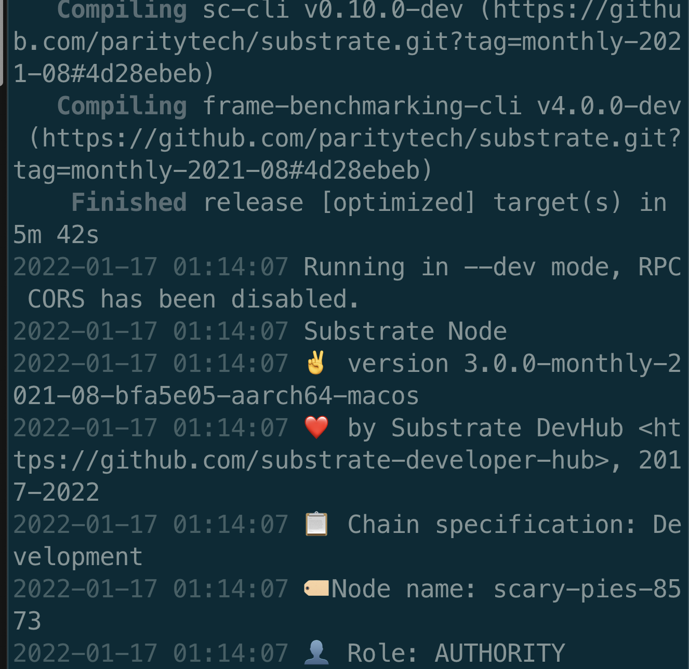

# Substrate进阶课程第四课作业

以 ocw-example 为基础，把它拷到 assignment 目录里来修改，最后提交这个代码库。

利用 offchain worker 取出 DOT 当前对 USD 的价格，并把写到一个 Vec 的存储里，你们自己选一种方法提交回链上，并在代码注释为什么用这种方法提交回链上最好。只保留当前最近的 10 个价格，其他价格可丢弃 （就是 Vec 的长度长到 10 后，这时再插入一个值时，要先丢弃最早的那个值）。

这个 http 请求可得到当前 DOT 价格：https://api.coincap.io/v2/assets/polkadot。

