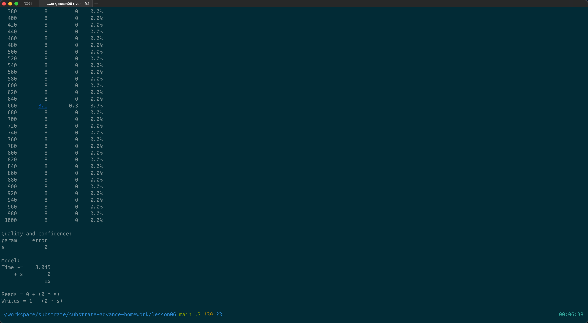
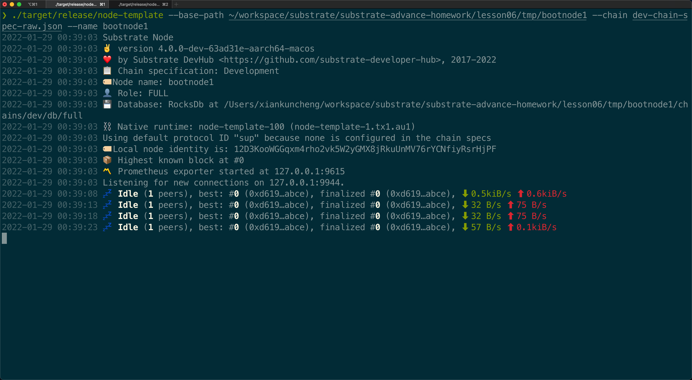
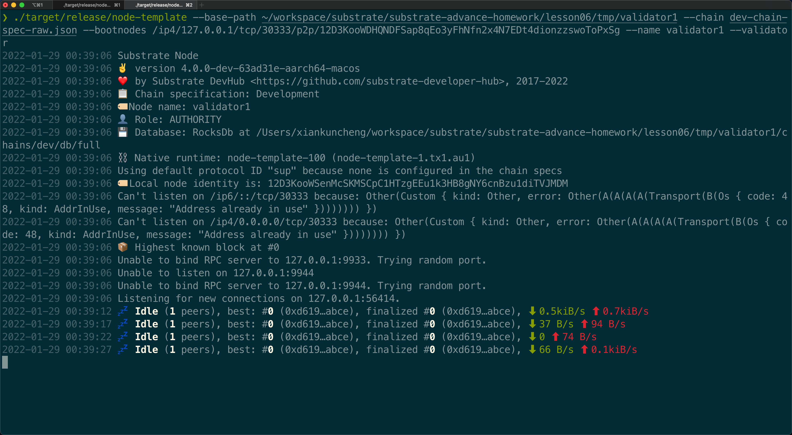

# Substrate进阶课程第六课作业

- 为 template 模块的 do_something 添加 benchmark 用例（也可以是其它自选
模块的可调用函数），并且将 benchmark 运行的结果转换为对应的权重定义
- 选择 node‑template 或者其它节点程序，生成 Chain Spec 文件（两种格式都需
要）；
- （附加题）根据 Chain Spec，部署公开测试网络

[chain-spec.json](./dev-chain-spec.json)
[chain-spec-raw.json](./dev-chain-spec-raw.json)

